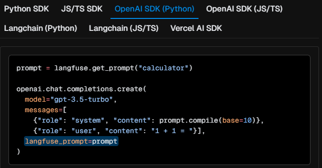

# Langflow with Langfuse
This shows how to integrate Langfuse with Langflow and how to link the prompt generation with the LLM calls.

## How to integrate Langfuse with Langflow
### Setup
- Install dependencies to virtual environment

```bash
python -m venv venv
source venv/bin/activate
pip install langfuse
pip install uv
uv pip install langflow
```

- Create a project in Langfuse and get the API key (secret key, public key, host name)
- Export those API keys as environment variables in the virtual environment.

```bash
export LANGFUSE_SECRET_KEY=
export LANGFUSE_PUBLIC_KEY=
export LANGFUSE_HOST_NAME=
```

### Run Langflow

```bash
python -m langflow run
```
If run this command, langflow will start a local server and you can access it at http://localhost:7860.
This will redirect to the langflow dashboard to create flow with components.
Once you run the flow, you can see the trace in `Langfuse`.

## How to trace prompt generation with LLM calls
- Export OPENAI_API_KEY in the virtual environment.
- Run the flow and see the trace in Langfuse.
```python
from langfuse.decorators import langfuse_context, observe
from langfuse import Langfuse
from langfuse.openai import openai

langfuse = Langfuse()


@observe(as_type="generation")
def nested_generation():
    prompt = langfuse.get_prompt("Test")

    response = (
        openai.chat.completions.create(
            model="gpt-3.5-turbo",
            max_tokens=100,
            messages=[
                {"role": "system", "content": prompt.compile()},
                {
                    "role": "user",
                    "content": "Once upon a time in a galaxy far, far away...",
                },
            ],
            langfuse_prompt=prompt,
        )
        .choices[0]
        .message.content
    )
    print(response)


@observe()
def main():
    nested_generation()


main()
```
